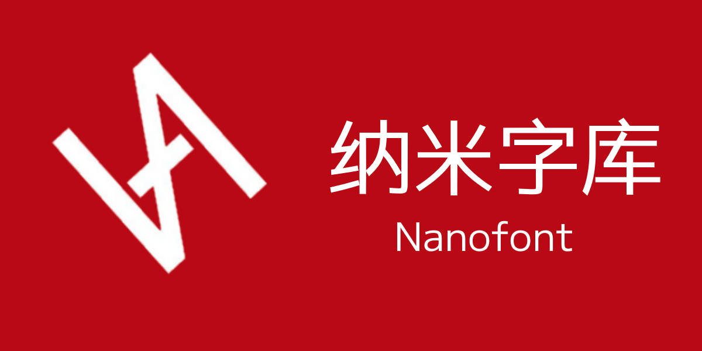

<h1>纳米之字，言语所赐</h1>

<h3>我是 <b>H.S.S. - 寒沙</b><h3>

### **10后**（2011）字体制作者一位

### 商业合作、其他合作及联系：*3582930858@qq.com* (备用: hackersam2011@gmail.com)
--------
> 合作列表
> |名称|联系方式|内容|
> |-|-|-|
> |不务正业的小鸡(Cod'dte)|QQ: **3126479747**|[江坡宋体](https://github.com/buwuzhengyedexiaoji/huaguansongti) / 纳米COTFL黑|

### 邮箱

### 关注链接

### 使用系统

--------

<!--
--------
> [!WARNING]
>
> 1.商业合作不接任何打印、文章、书籍、检错字等其他的无关工作
>
> 2.请认准NanoFont字库行业，拒绝盗版
>
> 3.本字库制造的字体统一按照OFL、COTFL等等协议精改，有允许修改和不允许修改的，请仔细辨认！

> [!IMPORTANT]
>
> 如果我制造的成品中，有错误的地方，请尽快联系，以解决相关问题
-->

<!--
-->
